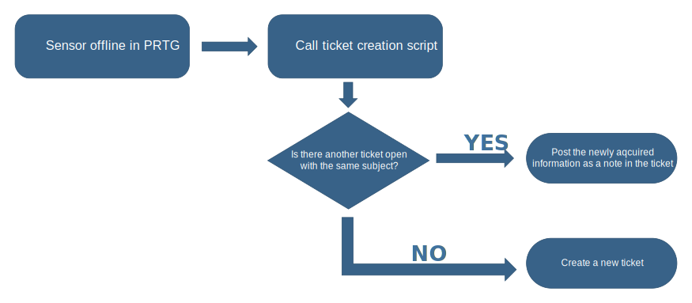
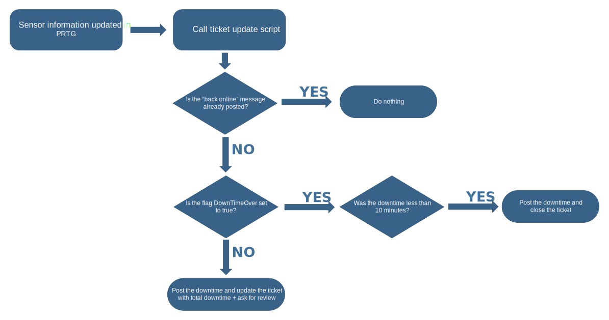
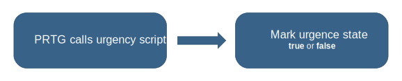

# PRTG Monitoring Reporting Automation

# About this project
Monitoring using [PRTG Network Monitor](https://www.paessler.com/nl) and reporting automation using the ticketing tool [4me](https://4me.com/). It makes use of the [4me REST API](https://developer.4me.com/v1/) to create, update, close and modify tickets whenever PRTG reports issues with monitored devices

  

# Configuration
Follow this step-by-step guide to properly implement these PowerShell scripts into your PRTG installation.

1. Place the files from the code folder (except for files in debug-scripts) into the **\notifications\exe** folder of your PRTG installation.
2. Copy the config.txt.example file into the **\notifications\exe** folder of your PRTG installation.
3. Rename the config.txt.example file to config.txt and adapt it to your needs. *I do not provide support on this part. If you're smart enough, you should be able to figure it out.*
4. Add the notification trigger in your PRTG and set it up as you want it. [extra documentation coming soon, feel free to contribute]

# Available functions

## CreateTicket

Before the 2 final actions can be completed, the script checks if there are already opened tickets for the same device. This has been built in to prevent multiple tickets for the same device.

  

The script can be used with the following arguments:

-  **-Category**  `<incident,rfc,rfi,compliment,complaint,reservation,other>`

-  **-Subject**  `"<enter the subject here, do not remove the double ticks>"`

-  **-ServiceInstance**  `<service instance ID>`

-  **-Impact**  `<low,medium,high,top>`  *when using TOP, downtime start is automatically added*

-  **-Note**  `'<enter the note here, do not remove the single ticks>'`

  

For example, you could run it like this from PRTG: `-Category incident -Subject "%device sensor reported as DOWN" -ServiceInstance 128401 -Impact top -Note 'Sensor: %name | %message | %linksensor'`

  

## UpdateTicket

This script is used to update an existing ticket, be it to post an extra note and/or end the downtime for the reported sensor. If the downtime recorded was less than 10 minutes, the tickets gets closed automatically. If the downtime was longer than 10 minutes, the ticket stays open.

  

The script can be used with the following arguments:

-  **-Subject**  `"<enter the subject here, do not remove the double ticks>"`

-  **-Note**  `'<enter the note here, do not remove the single ticks>'`

-  **-DowntimeOver**  `true | false`

  

For example, you could run it like this from PRTG: `-Subject "%device sensor reported as DOWN" -Note 'Downtime ended' -DowntimeOver true`

  

## MarkTicketUrgent

This script is used to mark a ticket as urgent or not urgent.

  

The script can be used with the following arguments:

-  **-Subject**  `"<enter the subject here, do not remove the double ticks>"`

-  **-StateUrgent**  `true | false`